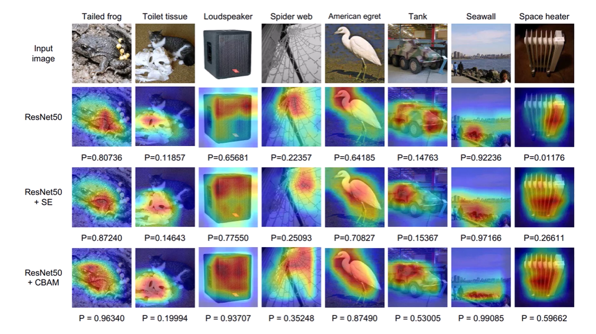
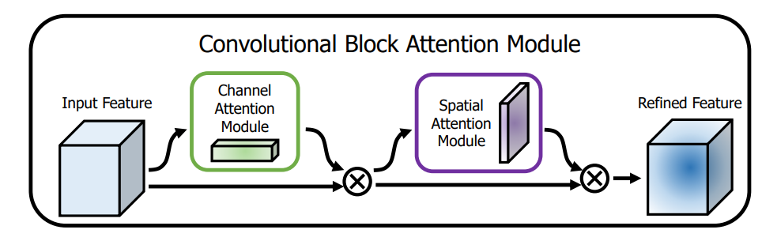
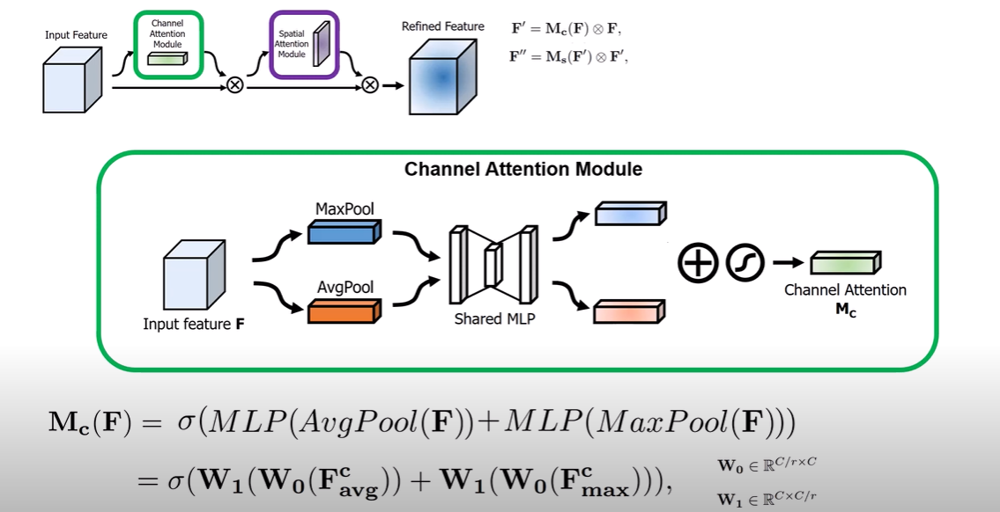
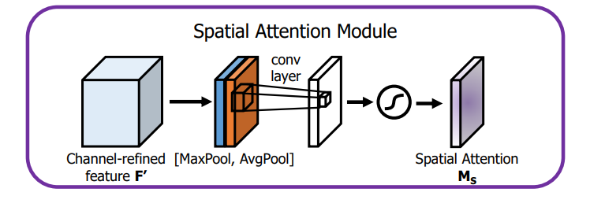
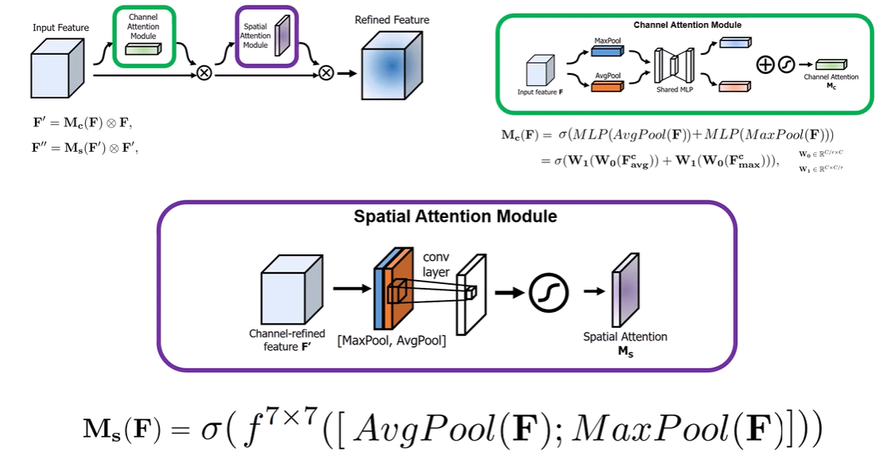
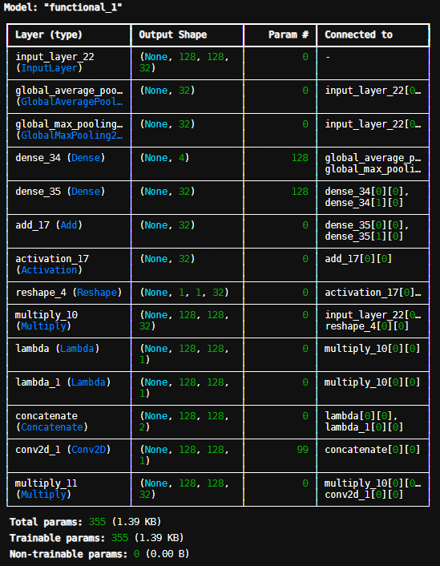

# Convolutional Block Attention Module(CBAM)
Focuses on the target object in an image and avoids the surroundings(makes it blury). 

__Demo__:


# Architecture:
__Layout__:

CBAM contains CAM(Channel Attention Module) and SAM(Spatial Attention Module) sequentially. 
> Input images goes through a Channel Attention Module and then the output of CAM is called attention map, then the input image features and attention map gets multiplied and gives a refined image features.

> Then again the refined image features goes through the Spatial Attention Module(SAM) and gives an output. Later the output and the refined features get multiplied. Thus, we get Refined Features.



**CBAM Code Block in TensorFlow**:
```
def CBAM(input_feature):
    input_feature = ChannelAttentionModule(input_feature, ratio=8)
    input_feature = SpatialAttentionModule(input_feature)
    return input_feature
```

---
## `Channel Attention Module(CAM):` 
CAM refines the important images from input by focusing on the channels in the feature maps generated by CNN. CAM says that __which feature map__ is important to learning.


**CAM Code Block in TensorFlow**
```
def ChannelAttentionModule(input_feature, ratio=8):
    channels = input_feature.shape[-1]  # Extract number of channels
    
    ## Shared MLP
    shared_layer1 = Dense(channels // ratio, activation='relu', use_bias=False)
    shared_layer2 = Dense(channels, use_bias=False)
    
    ## Average Pooling.
    avg_pool = GlobalAveragePooling2D()(input_feature)
    avg_pool = shared_layer1(avg_pool)
    avg_pool = shared_layer2(avg_pool)
    
    ## Max Pooling
    max_pool = GlobalMaxPooling2D()(input_feature)
    max_pool = shared_layer1(max_pool)
    max_pool = shared_layer2(max_pool)

    # Add Avg and Max pools and apply sigmoid.
    features = avg_pool + max_pool
    features = Activation("sigmoid")(features)
    # Reshape features to match input_feature dimensions.
    features = Reshape((1, 1, channels))(features)

    ## Multiply with the input image features.
    refined_features = Multiply()([input_feature, features])

    return refined_features
```

---
## `Spatial Attention Module(SAM):` 
Applied on the feature map. This enhance the area that defines the object. This enhances the input of the next CNN layer. Spatial Attention says, **what within the feature map** is crucial to learn.



**SAM Code Block in TensorFlow**
```
def SpatialAttentionModule(input_feature):
    ## Average Pooling.
    avg_pool = Lambda(lambda x: tf.reduce_mean(x, axis=-1, keepdims=True))(input_feature)

    ## Max Pooling
    max_pool = Lambda(lambda x: tf.reduce_max(x, axis=-1, keepdims=True))(input_feature)
    ## Concatenate
    features = Concatenate(axis=-1)([avg_pool, max_pool])

    ## Convulational Layer.
    features = Conv2D(1, kernel_size=7, padding="same", activation="sigmoid")(features)
    features = Multiply()([input_feature, features])

    return features
```
---
# Testing the CBAM:
```
if __name__ == "__main__":
    inputs = Input(shape=(128, 128, 32))
    y = CBAM(inputs)
    model = Model(inputs, y)
    model.summary()
```

__Output Summary__:



---
# Integrating CBAM with TensorFlow model:
```
# The input images of shape 28x28 with a single channel (grayscale images).
input_layer = tf.keras.Input(shape=(28, 28, 1))

# 2D convolutional layer
x = tf.keras.layers.Conv2D(32, (3,3), activation="relu")(input_layer)
# Max pooling with a 2x2 window is applied, reducing the spatial dimensions
x = tf.keras.layers.MaxPooling2D((2,2))(x)
# CBAM applied to the output of the previous layer.
x = CBAM(x)

# Another convolutional layer
x = tf.keras.layers.Conv2D(64, (3,3), activation='relu')(x)
# Max pooling
x = tf.keras.layers.MaxPooling2D((2,2))(x)

# The output from the previous layer is flattened into a 1D vector. This prepares the data for fully connected (dense) layers
x = tf.keras.layers.Flatten()(x)
# Two fully connected (dense) layers
x = tf.keras.layers.Dense(4, activation='relu')(x)
x = tf.keras.layers.Dense(4, activation='relu')(x)
The final output layer
output = tf.keras.layers.Dense(10, activation='softmax')(x)

model2 = tf.keras.Model(inputs=input_layer, outputs=output)

# Compile the model.
model2.compile(loss=tf.keras.losses.SparseCategoricalCrossentropy(),
               optimizer=tf.keras.optimizers.Adam(learning_rate=0.001),
               metrics=["accuracy"])

# Fit the model.
history2 = model2.fit(train_data_norm,
                      train_labels,
                      epochs=20,
                      validation_data=(test_data_norm, test_labels))
```


